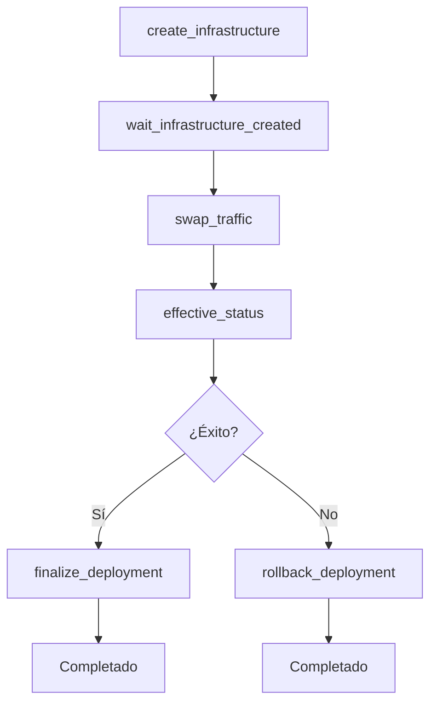
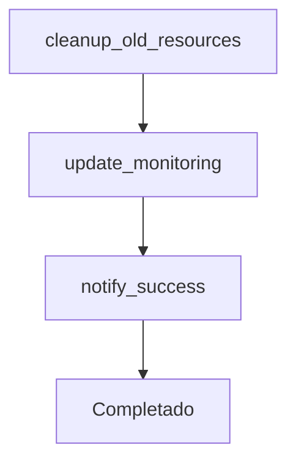
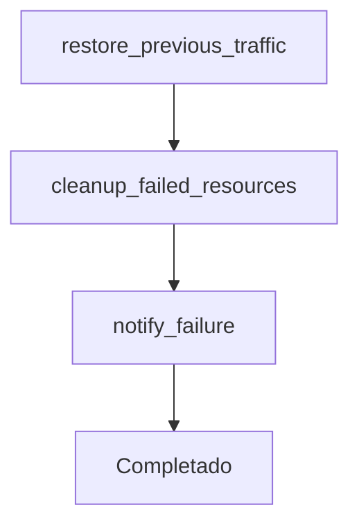

# Orkes / Conductor Deployment Pipeline PoC

Esta Prueba de Concepto muestra cómo registrar y ejecutar workflows avanzados de despliegue en Orkes/Netflix Conductor utilizando tareas HTTP contra un worker mock. El objetivo es tener un entorno reproducible en minutos para demostrar:

1. **`deploy_simple_v1`**: Un flujo de deploy completo con infraestructura, cambio de tráfico, verificación y acciones de finalización/rollback.
2. **`pipeline_simple_v1`**: Un pipeline que lanza múltiples deploys en paralelo por waves.
3. **`finalize_deployment_v1`**: Workflow para finalizar despliegues exitosos.
4. **`rollback_deployment_v1`**: Workflow para hacer rollback de despliegues fallidos.

La carpeta está configurada para funcionar con Conductor standalone (sin autenticación) o con Orkes Cloud.

## 1. Prerrequisitos (5 minutos)

* **Docker y Docker Compose** para ejecutar Conductor standalone y el worker mock.
* **Conductor standalone** ejecutándose en `localhost:8080` (ver sección 2).
* Herramientas de línea de comando: `bash`, `curl`, `jq`, `python3`.

### Opcional: Orkes Cloud
Si prefieres usar Orkes Cloud en lugar de Conductor standalone:
* Acceso a un endpoint de Orkes (`ORKES_BASE_URL`) y credenciales válidas (`ORKES_KEY`, `ORKES_SECRET`).

## 2. Configuración (2 minutos)

### 2.1 Levantar Conductor Standalone

```bash
# Ejecutar Conductor standalone en un contenedor
docker run -d --name conductor-standalone \
  -p 8080:8080 \
  conductoross/conductor-standalone:3.15.0

# Verificar que esté funcionando
curl -s http://localhost:8080/health | jq
```

### 2.2 Configurar Variables de Entorno

El archivo `.env` ya está configurado para Conductor standalone:

```env
# Conductor Standalone Configuration
CONDUCTOR_BASE_URL=http://localhost:8080
WORKER_BASE_URL=http://172.17.0.1:3000

# No authentication needed for Conductor standalone
```

**Nota**: Si usas Orkes Cloud, edita `.env` con tus credenciales:
```env
ORKES_BASE_URL=https://tu-instancia.orkes.io
ORKES_KEY=xxxx
ORKES_SECRET=yyyy
WORKER_BASE_URL=http://localhost:3000
```

## 3. Levantar el Worker Mock (2-3 minutos)

El worker expone múltiples endpoints para simular un flujo completo de despliegue:

```bash
cd worker
docker-compose up --build -d
```

**Endpoints disponibles:**
- `/create_infrastructure` - Crear recursos de infraestructura
- `/wait_infrastructure_created` - Esperar a que la infraestructura esté lista
- `/swap_traffic` - Cambiar el tráfico a la nueva versión
- `/effective_status` - Verificar el estado efectivo del despliegue
- `/finalize_deployment` - Finalizar despliegue exitoso
- `/rollback_deployment` - Hacer rollback de despliegue fallido
- `/health` - Health check

**Verificar que responde:**
```bash
curl -s http://localhost:3000/health | jq
```

## 4. Registrar Workflows y Task Definitions (1 minuto)

```bash
./scripts/register.sh
```

**Salida esperada:**
- Mensajes `2xx` en las respuestas
- Resumen con `[register] Done.`

**Workflows registrados:**
- `deploy_simple_v1` (v7) - Workflow principal de despliegue
- `pipeline_simple_v1` (v3) - Pipeline con múltiples waves
- `finalize_deployment_v1` (v1) - Finalización de despliegues exitosos
- `rollback_deployment_v1` (v1) - Rollback de despliegues fallidos

## 5. Ejecutar Pruebas (5-10 minutos)

### 5.1 Prueba de Deploy con Rollback

```bash
# Ejecutar deploy que fallará (scope no empieza con "svc-")
./scripts/run_deploy.sh

# El workflow seguirá este flujo:
# 1. create_infrastructure
# 2. wait_infrastructure_created  
# 3. swap_traffic
# 4. effective_status (fallará)
# 5. rollback_deployment
```

**Verificar logs del worker:**
```bash
cd worker && docker-compose logs --tail=20
```

### 5.2 Prueba de Deploy Exitoso

```bash
# Crear input para deploy exitoso
cat > tasks/samples/deploy_success_input.json << 'EOF'
{
  "name": "deploy_simple_v1",
  "version": 7,
  "input": {
    "scope": "svc-success",
    "version": "1.0.0",
    "env": "staging"
  }
}
EOF

# Ejecutar deploy exitoso
./scripts/run_deploy.sh tasks/samples/deploy_success_input.json

# El workflow seguirá este flujo:
# 1. create_infrastructure
# 2. wait_infrastructure_created
# 3. swap_traffic
# 4. effective_status (éxito)
# 5. finalize_deployment
```

### 5.3 Prueba de Pipeline

```bash
# Ejecutar pipeline con múltiples waves
./scripts/run_pipeline.sh

# El pipeline ejecutará:
# - Wave 1: deploy_simple_v1 para "service-a" y "service-b" en paralelo
# - Wave 2: deploy_simple_v1 para "service-b" en paralelo
```

## 6. Monitorear Ejecuciones

### 6.1 Ver Estado de Workflows

```bash
# Listar workflows registrados
curl -s http://localhost:8080/api/metadata/workflow | jq '.[].name'

# Ver estado de un workflow específico (reemplaza WORKFLOW_ID)
curl -s "http://localhost:8080/api/workflow/WORKFLOW_ID" | jq '.status'

# Ver detalles completos
curl -s "http://localhost:8080/api/workflow/WORKFLOW_ID" | jq '.'
```

### 6.2 UI de Conductor (Opcional)

Abre `http://localhost:8080` en tu navegador para ver:
- Workflows registrados
- Ejecuciones en tiempo real
- Diagramas de flujo
- Logs detallados

## 7. Flujo de Trabajo Detallado

### 7.1 Workflow de Deploy (`deploy_simple_v1`)



### 7.2 Workflow de Finalización (`finalize_deployment_v1`)



### 7.3 Workflow de Rollback (`rollback_deployment_v1`)



## 8. Personalización

### 8.1 Modificar Lógica de Decisión

Edita `worker/src/server.py` en la función `effective_status`:

```python
# Cambiar la lógica de éxito/fallo
scope = payload.get("scope", "")
success = scope and scope.startswith("svc-")  # Actual lógica
# success = scope == "mi-servicio-especial"  # Nueva lógica
```

### 8.2 Agregar Nuevos Pasos

1. **Agregar endpoint en el worker:**
```python
@app.post("/mi_nuevo_paso")
async def mi_nuevo_paso(request: Request) -> Dict[str, Any]:
    payload = await request.json()
    response = _log_step("mi_nuevo_paso", payload)
    return response
```

2. **Agregar task definition en `tasks/taskdefs.json`**
3. **Agregar tarea en el workflow**
4. **Reconstruir y registrar:**
```bash
cd worker && docker-compose up --build -d
cd .. && ./scripts/register.sh
```

## 9. Solución de Problemas

| Problema | Síntoma | Solución |
|----------|---------|----------|
| Worker no responde | `Connection refused` | Verificar que el worker esté ejecutándose: `docker-compose ps` |
| Conductor no accede al worker | `NoHttpResponseException` | Verificar IP en `.env`: `WORKER_BASE_URL=http://172.17.0.1:3000` |
| Workflow falla en SWITCH | `evaluatorType field is required` | Verificar que el workflow tenga `evaluatorType: "javascript"` |
| Variables no se resuelven | `scope: None` en logs | Verificar sintaxis de variables: `${workflow.input.scope}` |

## 10. Limpieza

```bash
# Detener worker
cd worker && docker-compose down

# Detener Conductor
docker stop conductor-standalone
docker rm conductor-standalone

# Limpiar workflows (opcional)
./scripts/cleanup.sh
```

## 11. Estructura del Repositorio

```
.
├─ .env                          # Configuración (ya creado)
├─ README.md                     # Este archivo
├─ scripts/
│  ├─ register.sh               # Registrar workflows y task definitions
│  ├─ run_deploy.sh             # Ejecutar workflow de deploy
│  ├─ run_pipeline.sh           # Ejecutar pipeline
│  └─ status.sh                 # Ver estado de workflows
├─ tasks/
│  ├─ taskdefs.json             # Definiciones de tareas HTTP
│  └─ samples/
│     ├─ deploy_input.json      # Input para deploy
│     ├─ deploy_success_input.json # Input para deploy exitoso
│     └─ pipeline_input.json    # Input para pipeline
├─ workflows/
│  ├─ deploy_simple_v1.json     # Workflow principal de deploy
│  ├─ pipeline_simple_v1.json   # Pipeline con waves
│  ├─ finalize_deployment_v1.json # Finalización de despliegues
│  └─ rollback_deployment_v1.json # Rollback de despliegues
└─ worker/
   ├─ Dockerfile
   ├─ docker-compose.yml
   ├─ pyproject.toml
   └─ src/
      └─ server.py              # Worker con todos los endpoints
```

## 12. Tiempo Total Estimado

- **Configuración inicial**: 5-7 minutos
- **Primera ejecución**: 2-3 minutos
- **Ejecuciones posteriores**: 30 segundos

**Total end-to-end**: **7-10 minutos** para tener un sistema completo de despliegue con infraestructura, cambio de tráfico, verificación y rollback automático.

---

> **Nota**: Esta PoC demuestra un flujo completo de despliegue con toma de decisiones automática basada en el estado del servicio. El worker simula todas las operaciones de infraestructura, pero en un entorno real se conectaría con APIs de AWS, Azure, GCP, etc.